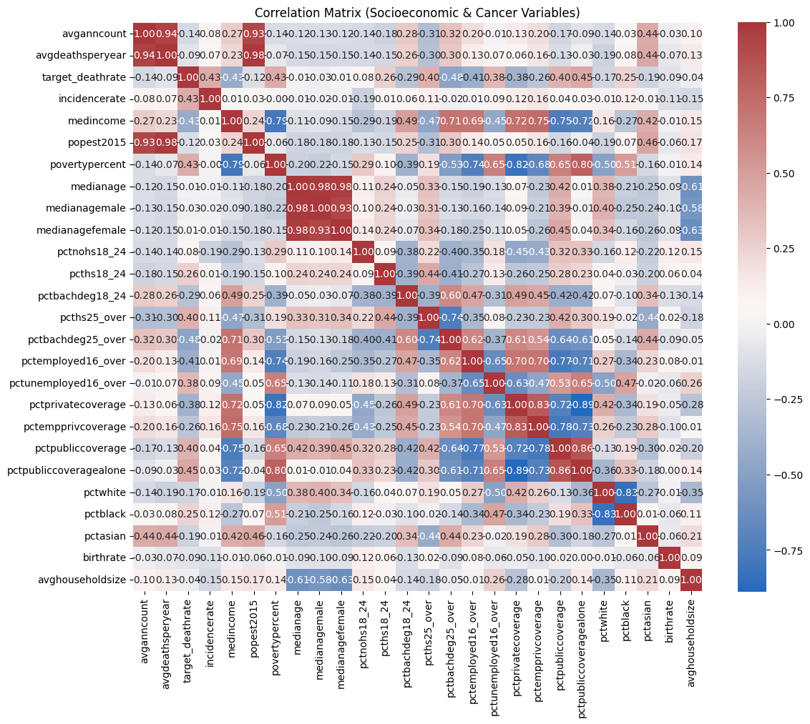
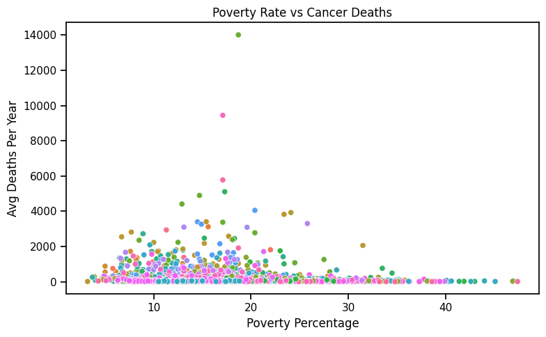
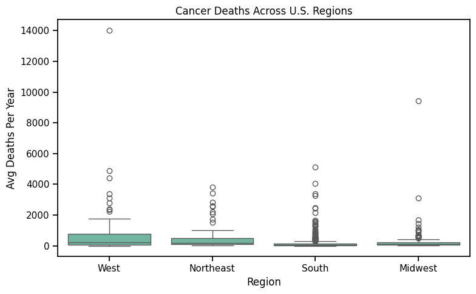

# Impact of Socioeconomic Factors on Cancer Incidence and Outcomes

BU CS 506: Data Science Tools and Applications  
Final Project Proposal  
Lance Galletti  
Xinyu Li, Wenshou He, Benjamin Pfeiffer  
Monday, February 10th, 2025

## 1. Project Description

Cancer remains one of the leading causes of death worldwide, and multiple studies suggest that socioeconomic factors may play a role in cancer incidence and mortality rates. This project investigates the relationship between socioeconomic status and cancer rates by analyzing key variables such as median income and poverty levels across U.S. counties.

The study aims to determine whether lower income levels correlate with higher cancer incidence and mortality rates and whether certain regions are disproportionately affected due to socioeconomic disparities. By leveraging statistical modeling techniques, this project will assess the strength and significance of these relationships.

---

## 2. Project Goals

The primary objectives of this study are:

- **Analyze the correlation** between socioeconomic factors and cancer rates
- **Determine the statistical significance** of income and poverty levels on cancer incidence and mortality
- **Apply hypothesis testing and regression models** to quantify relationships
- **Visualize findings** using effective data visualizations

---

## 3. Data Collection Plan

The data used in this study consists of county-level cancer rates and socioeconomic variables. The primary sources include:

- **Cancer incidence and mortality data** (e.g., obtained from the CDC, SEER database, or public health datasets)
- **Socioeconomic data** such as median household income and poverty rates (e.g., U.S. Census Bureau, American Community Survey)
- **Additional demographic and regional data** to control for potential confounding factors

If necessary, data will be preprocessed by cleaning missing values, normalizing numerical variables, and encoding categorical features.

---

## 4. Data Modeling Approach

To evaluate the impact of socioeconomic factors on cancer rates, the following methods will be implemented:

- **Linear Regression:** To model the relationship between median income/poverty levels and cancer rates
- **Hypothesis Testing** (e.g., Alexander-Govern Test): To determine if significant differences exist among different income groups
- **Correlation Analysis:** To assess how strongly different socioeconomic variables relate to cancer incidence and mortality
- **Potential Advanced Models:** If necessary, decision trees or machine learning approaches (e.g., XGBoost) may be explored

---

## 5. Data Visualization Plan

To effectively communicate the findings, the following visualizations will be used:

- **Scatter plots** to illustrate the correlation between cancer rates and socioeconomic variables
- **Bar charts** showing differences in cancer rates across income groups
- **Heatmaps** for correlation matrices to identify strong relationships
- **Geospatial visualizations** to highlight regional disparities

---

## 6. Test Plan

To validate the findings and ensure model robustness:

- Data will be split into **training (80%) and testing (20%) sets** for model validation
- **Cross-validation techniques** may be applied to prevent overfitting
- **Statistical significance testing** will be conducted to confirm findings
- If time permits, **sensitivity analysis** will be performed to check how different model assumptions impact the results.

---

## 7. Project Timeline (Two-Month Plan)

(Note: This is an initial plan and may be subject to changes based on data availability, unforeseen challenges, and project requirements.) A structured timeline is crucial to ensure project completion. Below is the proposed schedule:

### Week 1-2: Initial Setup and Data Collection
- Define research scope and finalize data sources
- Collect and preprocess data (clean missing values, normalize data, encode categorical features)
- Conduct exploratory data analysis (EDA) and generate descriptive statistics

### Week 3-4: Initial Modeling and Analysis
- Apply correlation analysis to identify key variables
- Implement initial linear regression and hypothesis testing
- Begin drafting preliminary visualizations

### Week 5-6: Model Refinement and Advanced Techniques
- Test alternative models (e.g., decision trees, XGBoost if needed)
- Conduct statistical significance tests
- Fine-tune models and perform feature selection

### Week 7: Finalization of Results and Interpretation
- Generate final visualizations
- Interpret and summarize findings
- Ensure reproducibility by refining code and data documentation

### Week 8: Report Writing and Presentation Preparation
- Write final project report summarizing methods, results, and conclusions
- Create a presentation with key insights and visualizations
- Conduct peer reviews and finalize all deliverables

# Midterm Report

BU CS 506: Data Science Tools and Applications  
Final Project Proposal  
Lance Galletti  
Xinyu Li, Wenshou He, Benjamin Pfeiffer  
Monday, March 31st, 2025

## Preliminary visualizations of data

### Correlation Heatmap

### Poverty Rate vs Cancer Deaths

### Cancer Deaths Across U.S. Regions

## Data processing Tasks
### Data Collection and Preprocessing
- **Data Sources**: 
  - `cancer_reg.csv` - Cancer-related statistics.
  - `avg-household-size.csv` - Household size data.
- **Data Cleaning**:
  - Stripped column names of extra spaces and converted to lowercase.
  - Merged datasets based on the `geography` column.
  - Extracted `county` and `state` from the `geography` column.
  - Removed less relevant columns such as `index`, `studypercap`, `percentmarried`, etc.

### Correlation Analysis and Initial Modeling
- **Exploratory Data Analysis (EDA)**:
  - Computed correlations between various features and `avgdeathsperyear`.
  - Visualized the correlation matrix using a heatmap.
  - Plotted scatter plots to examine relationships between `povertypercent`, `education`, and cancer deaths.
- **Regression Modeling**:
  - Selected key independent variables based on correlation analysis.
  - Fitted a linear regression model to predict `avgdeathsperyear`.
  - Evaluated model performance using R-squared and residual analysis.
  - Identified potential non-linearity in relationships, indicating possible improvements with advanced regression techniques.
- **Feature Engineering**:
  - Created a new `region` variable by mapping states into broader regions.
  - Identified strong and weak correlations between socioeconomic factors and cancer mortality rates.

## Data Modeling Methods: XGBoost
- **Algorithm:** `XGBRegressor` from the `xgboost.sklearn` package.  
- **Purpose:** We applied XGBoost due to its efficiency and performance in handling complex datasets with non-linear relationships. This model provides great flexibility and can handle large datasets with many features.  
- **Parameters:**  
  - `n_estimators=1000`: We chose a high number of estimators to ensure enough boosting rounds to capture the complexity of the data.
  - `learning_rate=0.1`: A moderate learning rate was chosen to prevent overshooting during training.
  - `early_stopping_rounds=5`: We implemented early stopping to avoid overfitting by stopping training when the performance on the validation set stopped improving.
- **Pipeline Integration:** The preprocessing steps, such as encoding categorical features and scaling numerical features, were included in a `Pipeline` to ensure the consistency of transformations during both training and prediction phases.  
- **Model Evaluation:** We used a separate validation set (`X_test` and `y_test`) to evaluate model performance.

## Preliminary Results
- **Correlation Analysis**:
  - Strong positive correlation between poverty rate and cancer deaths.
  - Moderate negative correlation between higher education rates and cancer deaths.
- **Data Trends**:
  - States with higher poverty percentages tend to have higher average deaths per year.
  - Regions with higher educational attainment show slightly lower cancer mortality rates.
- **Regression Model**:
  - The model shows that poverty rate has a significant positive coefficient, indicating a strong association with cancer mortality.
  - Adjusted R-squared value suggests a moderate fit, indicating potential for further feature refinement.
  - Residual analysis shows some non-linearity, suggesting possible improvements with polynomial terms or interaction effects.
- **XGBoost**:
  - The XGBoost model showed promising results in terms of accuracy and predictive performance.
  - By incorporating early stopping and tuning hyperparameters such as the number of estimators and the learning rate, we were able to achieve reasonable predictions with minimal overfitting.
- **Current Issue**:
  - Feature selection needed to be refined based on correlation findings.
  - Consider additional socioeconomic or healthcare-related features for deeper insights.

## Next Steps  
- Hyperparameter tuning of the XGBoost model to improve performance using cross-validation.
- Feature selection to refine the model and potentially enhance prediction accuracy.
- Further evaluation on the test set to validate generalization ability of the model.
