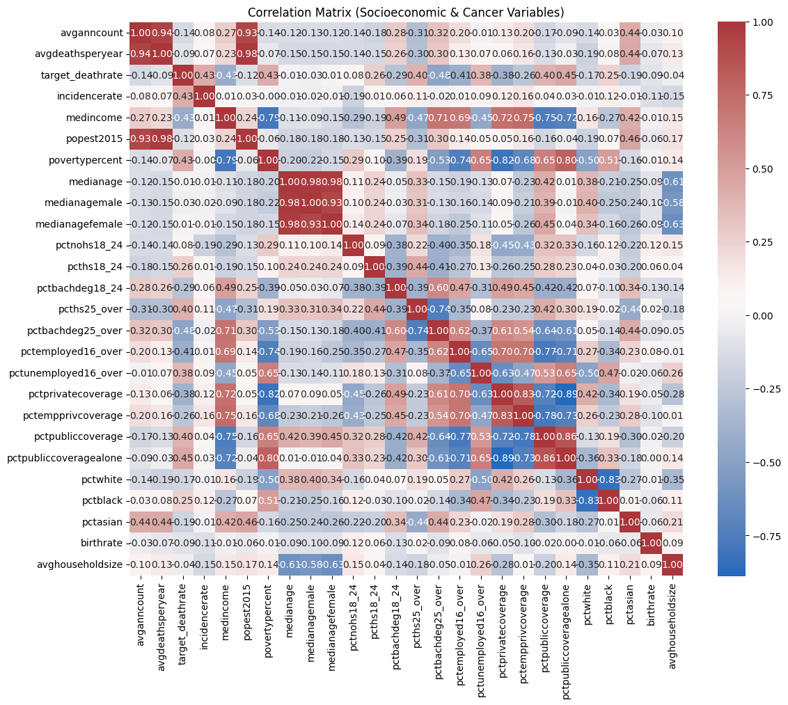
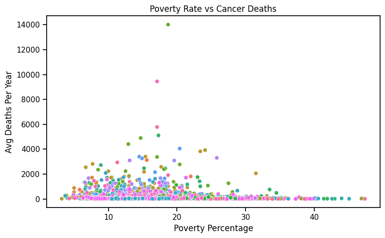
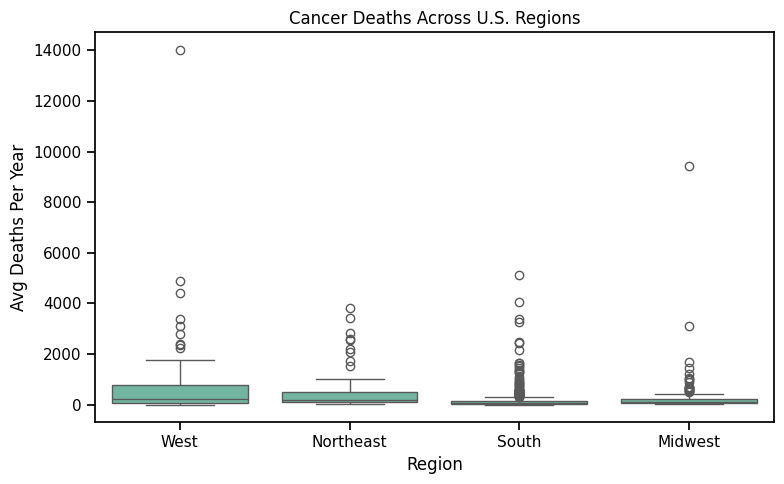
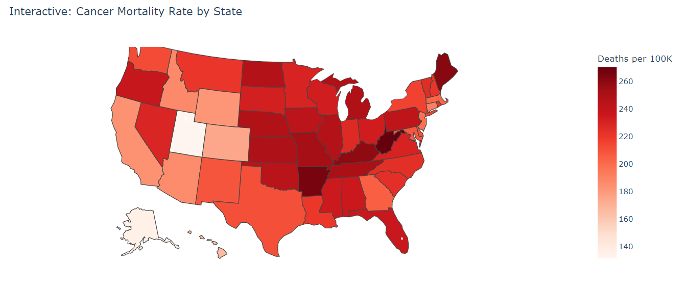
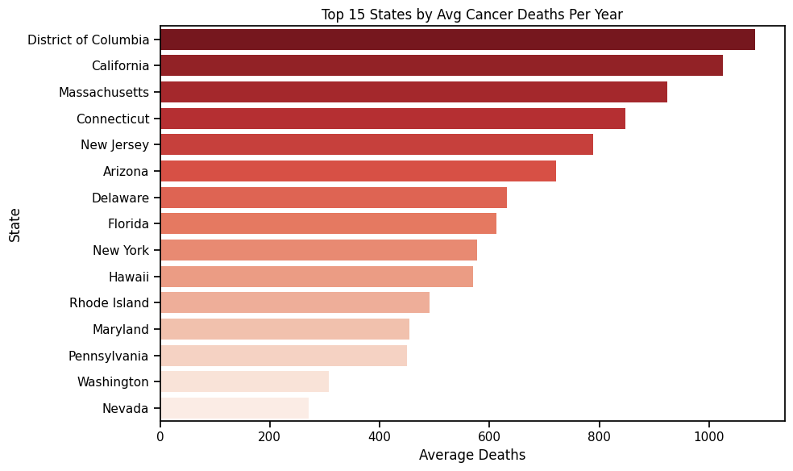
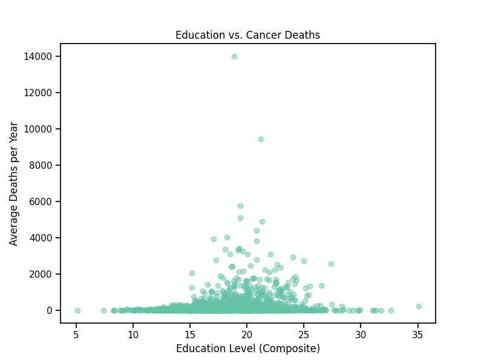
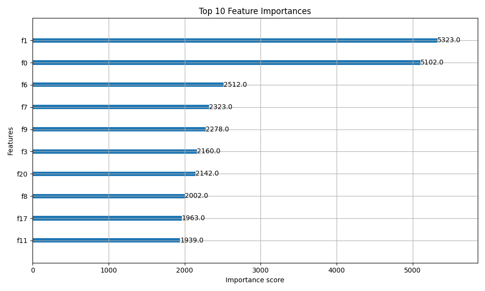
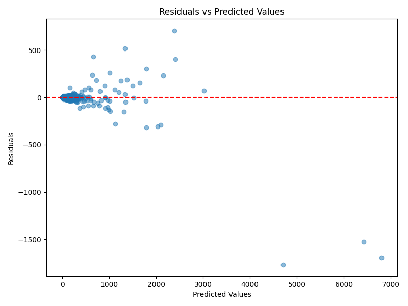

# Impact of Socioeconomic Factors on Cancer Incidence and Outcomes

BU CS 506: Data Science Tools and Applications  
Project Proposal  
Lance Galletti  
Xinyu Li, Wenshou He, Benjamin Pfeiffer  
Monday, February 10<sup>th</sup>, 2025

## 1. Project Description

Cancer remains one of the leading causes of death worldwide, and multiple studies suggest that socioeconomic factors may play a role in cancer incidence and mortality rates. This project investigates the relationship between socioeconomic status and cancer rates by analyzing key variables such as median income and poverty levels across U.S. counties.

The study aims to determine whether lower income levels correlate with higher cancer incidence and mortality rates and whether certain regions are disproportionately affected due to socioeconomic disparities. By leveraging statistical modeling techniques, this project will assess the strength and significance of these relationships.

---

## 2. Project Goals

The primary objectives of this study are:

- **Analyze the correlation** between socioeconomic factors and cancer rates
- **Determine the statistical significance** of income and poverty levels on cancer incidence and mortality
- **Apply hypothesis testing and regression models** to quantify relationships
- **Visualize findings** using effective data visualizations

---

## 3. Data Collection Plan

The data used in this study consists of county-level cancer rates and socioeconomic variables. The primary sources include:

- **Cancer incidence and mortality data** (e.g., obtained from the CDC, SEER database, or public health datasets)
- **Socioeconomic data** such as median household income and poverty rates (e.g., U.S. Census Bureau, American Community Survey)
- **Additional demographic and regional data** to control for potential confounding factors

If necessary, data will be preprocessed by cleaning missing values, normalizing numerical variables, and encoding categorical features.

---

## 4. Data Modeling Approach

To evaluate the impact of socioeconomic factors on cancer rates, the following methods will be implemented:

- **Linear Regression:** To model the relationship between median income/poverty levels and cancer rates
- **Hypothesis Testing** (e.g., Alexander-Govern Test): To determine if significant differences exist among different income groups
- **Correlation Analysis:** To assess how strongly different socioeconomic variables relate to cancer incidence and mortality
- **Potential Advanced Models:** If necessary, decision trees or machine learning approaches (e.g., XGBoost) may be explored

---

## 5. Data Visualization Plan

To effectively communicate the findings, the following visualizations will be used:

- **Scatter plots** to illustrate the correlation between cancer rates and socioeconomic variables
- **Bar charts** showing differences in cancer rates across income groups
- **Heatmaps** for correlation matrices to identify strong relationships
- **Geospatial visualizations** to highlight regional disparities

---

## 6. Test Plan

To validate the findings and ensure model robustness:

- Data will be split into **training (80%) and testing (20%) sets** for model validation
- **Cross-validation techniques** may be applied to prevent overfitting
- **Statistical significance testing** will be conducted to confirm findings
- If time permits, **sensitivity analysis** will be performed to check how different model assumptions impact the results.

---

## 7. Project Timeline (Two-Month Plan)

(Note: This is an initial plan and may be subject to changes based on data availability, unforeseen challenges, and project requirements.) A structured timeline is crucial to ensure project completion. Below is the proposed schedule:

### Week 1-2: Initial Setup and Data Collection
- Define research scope and finalize data sources
- Collect and preprocess data (clean missing values, normalize data, encode categorical features)
- Conduct exploratory data analysis (EDA) and generate descriptive statistics

### Week 3-4: Initial Modeling and Analysis
- Apply correlation analysis to identify key variables
- Implement initial linear regression and hypothesis testing
- Begin drafting preliminary visualizations

### Week 5-6: Model Refinement and Advanced Techniques
- Test alternative models (e.g., decision trees, XGBoost if needed)
- Conduct statistical significance tests
- Fine-tune models and perform feature selection

### Week 7: Finalization of Results and Interpretation
- Generate final visualizations
- Interpret and summarize findings
- Ensure reproducibility by refining code and data documentation

### Week 8: Report Writing and Presentation Preparation
- Write final project report summarizing methods, results, and conclusions
- Create a presentation with key insights and visualizations
- Conduct peer reviews and finalize all deliverables

# Midterm Report

Midterm Presentation: https://youtu.be/8sEUC1Uwf7Q

BU CS 506: Data Science Tools and Applications  
Midterm Report  
Lance Galletti  
Xinyu Li, Wenshou He, Benjamin Pfeiffer  
Monday, March 31<sup>st</sup>, 2025

## Preliminary visualizations of data

### Correlation Heatmap


### Poverty Rate vs Cancer Deaths


### Cancer Deaths Across U.S. Regions


## Data processing Tasks
### Data Collection and Preprocessing
- **Data Sources**: 
  - `cancer_reg.csv` - Cancer-related statistics.
  - `avg-household-size.csv` - Household size data.
- **Data Cleaning**:
  - Stripped column names of extra spaces and converted to lowercase.
  - Merged datasets based on the `geography` column.
  - Extracted `county` and `state` from the `geography` column.
  - Removed less relevant columns such as `index`, `studypercap`, `percentmarried`, etc.

### Correlation Analysis and Initial Modeling
- **Exploratory Data Analysis (EDA)**:
  - Computed correlations between various features and `avgdeathsperyear`.
  - Visualized the correlation matrix using a heatmap.
  - Plotted scatter plots to examine relationships between `povertypercent`, `education`, and cancer deaths.
- **Regression Modeling**:
  - Selected key independent variables based on correlation analysis.
  - Fitted a linear regression model to predict `avgdeathsperyear`.
  - Evaluated model performance using R-squared and residual analysis.
  - Identified potential non-linearity in relationships, indicating possible improvements with advanced regression techniques.
- **Feature Engineering**:
  - Created a new `region` variable by mapping states into broader regions.
  - Identified strong and weak correlations between socioeconomic factors and cancer mortality rates.

## Data Modeling Methods: XGBoost
- **Algorithm:** `XGBRegressor` from the `xgboost.sklearn` package.  
- **Purpose:** We applied XGBoost due to its efficiency and performance in handling complex datasets with non-linear relationships. This model provides great flexibility and can handle large datasets with many features.  
- **Parameters:**  
  - `n_estimators=1000`: We chose a high number of estimators to ensure enough boosting rounds to capture the complexity of the data.
  - `learning_rate=0.1`: A moderate learning rate was chosen to prevent overshooting during training.
  - `early_stopping_rounds=5`: We implemented early stopping to avoid overfitting by stopping training when the performance on the validation set stopped improving.
- **Pipeline Integration:** The preprocessing steps, such as encoding categorical features and scaling numerical features, were included in a `Pipeline` to ensure the consistency of transformations during both training and prediction phases.  
- **Model Evaluation:** We used a separate validation set (`X_test` and `y_test`) to evaluate model performance.

## Preliminary Results
- **Correlation Analysis**:
  - Strong positive correlation between poverty rate and cancer deaths.
  - Moderate negative correlation between higher education rates and cancer deaths.
- **Data Trends**:
  - States with higher poverty percentages tend to have higher average deaths per year.
  - Regions with higher educational attainment show slightly lower cancer mortality rates.
- **Regression Model**:
  - The model shows that poverty rate has a significant positive coefficient, indicating a strong association with cancer mortality.
  - Adjusted R-squared value suggests a moderate fit, indicating potential for further feature refinement.
  - Residual analysis shows some non-linearity, suggesting possible improvements with polynomial terms or interaction effects.
- **XGBoost**:
  - The XGBoost model showed promising results in terms of accuracy and predictive performance.
  - By incorporating early stopping and tuning hyperparameters such as the number of estimators and the learning rate, we were able to achieve reasonable predictions with minimal overfitting.
- **Current Issue**:
  - Feature selection needed to be refined based on correlation findings.
  - Consider additional socioeconomic or healthcare-related features for deeper insights.

## Next Steps  
- Hyperparameter tuning of the XGBoost model to improve performance using cross-validation.
- Feature selection to refine the model and potentially enhance prediction accuracy.
- Further evaluation on the test set to validate generalization ability of the model.


# Final Report

Final Presentation: linklinklink

BU CS 506: Data Science Tools and Applications  
Final Report  
Lance Galletti  
Xinyu Li, Wenshou He, Benjamin Pfeiffer  
Monday, April 28<sup>th</sup>, 2025

## 1. How to Build and Run the Code

Follow the steps below to set up the environment, install dependencies, and run the analysis pipeline.

### Environment Setup

All dependencies are listed in the `requirements.txt` file.

To set up the environment:

```bash
# 1. Fork and clone the repository
git clone <your-repo-ssh-url>
cd <your-project-folder>

# 2. Create a virtual environment
python3 -m venv .venv

# 3. Activate the virtual environment
# On Linux/Mac
source .venv/bin/activate
# On Windows
.venv\Scripts\activate

# 4. Install all dependencies
pip install -r requirements.txt
```

### Makefile Instructions

This project provides a `Makefile` to simplify environment setup, dependency management, notebook execution, and testing.

Here are the available commands:

1. **Set up environment and install dependencies**

Create a new virtual environment `.venv/`, upgrade pip, and install all required packages from `requirements.txt`:

```bash
make setup
```

2. **Launch Jupyter Notebook to run the code interactively**

Start a Jupyter Notebook server to run and explore the project notebooks manually:

```bash
make run
```

3. **Install dependencies only**

If you already have a virtual environment, you can simply install the project dependencies:

```bash
make install
```

4. **Run tests**

Run all test scripts located under the `tests/` directory using `pytest`.

```bash
make test
```

5. **Clean the environment**

Remove the virtual environment `.venv/` and temporary files.

```bash
make clean
```

## 2. Testing and GitHub Workflow

- **Test Scripts:**  
  Lightweight test cases were created under the `tests/` directory using `pytest`. These tests focus on verifying critical components of the project, such as:
  - Successful data loading.
  - Integrity of model prediction outputs (no missing or NaN values).

- **GitHub Actions Workflow:**  
  A GitHub Actions workflow was configured (`.github/workflows/ci.yml`) to automatically run the test suite upon each push or pull request.  
  The workflow sets up a Python environment, installs project dependencies, and executes `pytest` to ensure the codebase remains functional and reproducible.

## 3. Data Visualizations

This section presents key visualizations used to explore the relationships between socioeconomic factors and cancer incidence and mortality.

### 3.1 Correlation Matrix

<p align="center">
  
</p>

The correlation matrix above visualizes pairwise correlations between socioeconomic indicators and cancer-related variables.  

Key observations include:

- Strong positive correlation between `avganncount` (average annual cancer cases) and `avgdeathsperyear`.
- Moderate negative correlation between `povertypercent` and `median income`, suggesting areas with higher poverty levels tend to have lower median incomes.

The correlation patterns identified here help inform feature selection and model interpretation in later stages of the analysis.

### 3.2 Cancer Mortality Rate by State

<p align="center">
  
</p>

This choropleth map visualizes the cancer mortality rate (deaths per 100,000 population) across U.S. states.  
Each state is shaded according to its reported cancer death rate, with darker colors indicating higher mortality.

**Key observations:**
- States in the Southeast, including Mississippi, Alabama, and Kentucky, tend to have higher cancer mortality rates.
- This geographic trend reinforces existing public health research about disparities in healthcare access and socioeconomic conditions across regions.

**Technical notes:**
- Geospatial mapping was done using GeoPandas.
- Shapefile source: U.S. Census Bureau 2018 TIGER/Line shapefiles.
- `death_rate` was calculated and merged with shapefile data for state-level visualization.

### 3.3 Top 15 States by Average Cancer Deaths

<p align="center">
  
</p>

This bar chart highlights the top 15 states with the highest average number of annual cancer deaths.

**Key insights:**
- California, and Florida rank among the top due to both their large population sizes and relatively high cancer mortality rates.
- Other high-ranking states like Pennsylvania and Ohio reflect not just population but possibly environmental and socioeconomic factors.

This visualization complements the choropleth map by providing absolute comparisons rather than rate-based ones.

### Summary of Visualizations
Some plots are explained in the `Results` section.

| Visualization | Format | Insight |
|---------------|--------|---------|
| Correlation Matrix | Heatmap | Reveals feature relationships |
| Poverty vs. Cancer Deaths | Scatter | Shows poverty-related trends |
| Cancer Mortality by Region | Bar Chart | Exposes regional disparities |
| Cancer Mortality by State | Choropleth | Visualizes geographic risk |
| Top 15 States by Deaths | Bar Chart | Compares high-death states |
| Feature Importance | Bar Chart | Highlights key predictors |
| Residual Plot | Scatter | Validates model behavior |

## 4. Data Processing and Modeling Description

This section summarizes the full data processing and modeling workflow from Week 1–8.

### 4.1 Week 1–2: Data Collection and Preprocessing

- **Data Loading**
  - Loaded `cancer_reg.csv` containing cancer statistics.
  - Loaded `avg-household-size.csv` containing average household size by geography.

- **Data Cleaning**
  - Stripped whitespace from column names and converted them to lowercase.
  - Merged datasets using `geography` as the key.
  - Extracted `state` and `county` information from `geography`.
  - Dropped irrelevant columns (e.g., `binnedinc`, `studypercap`, `percentmarried`).
  - Checked and handled missing values:
    - Removed columns with excessive missingness.
    - Imputed remaining missing values using the median strategy.

- **Feature Engineering**
  - Created new columns:
    - `region`: Assigned based on the state to one of four U.S. regions.
  - Applied winsorization to reduce the effect of outliers.
  - Applied log transformation (`np.log1p`) on highly skewed variables such as `medianincome` and `avgdeathsperyear`.

- **Initial Visualization**
  - Plotted histograms and boxplots to explore distributions.
  - Generated a correlation heatmap (`plots/correlation_heatmap.png`) to examine variable relationships.

### 4.2 Week 3–4: Exploratory Data Analysis and Baseline Modeling

- **Exploratory Data Analysis (EDA)**
  - Examined pairwise correlations between socioeconomic variables and cancer mortality.
  - Scatter plots were generated:
    - Poverty rate vs. average cancer deaths.
    - Household size vs. cancer deaths.

- **Baseline Modeling**
  - Implemented **Linear Regression** to predict `avgdeathsperyear` using key features like `povertypercent`, `medianincome`, and `education`.
  - Evaluated baseline model:
    - Achieved moderate R² scores.
    - Residual plots revealed potential non-linearity and heteroscedasticity.

- **Visualization**
  - Scatter plot showing poverty rate vs. cancer deaths (`plots/poverty_vs_deaths.png`).
  - Regional cancer deaths summarized in bar charts (`plots/Cancer_deaths_regions.png`).

### 4.3 Week 5–6: Feature Engineering and Model Enhancement

- **Feature Engineering**
  - Introduced an interaction term: `povertypercent * education` to capture combined effects.
  - Created dummy variables for regions using one-hot encoding.
  - Updated preprocessing pipeline to handle numerical and categorical columns separately:
    - Imputation → Scaling → Encoding.

- **Advanced Modeling: XGBoost**
  - Implemented `XGBRegressor` with parameters:
    - `n_estimators=1000`
    - `learning_rate=0.1`
    - `early_stopping_rounds=5`
  - Used `Pipeline` to combine preprocessing and model training.
  - Early stopping was based on validation set performance to prevent overfitting.

- **Model Evaluation**
  - Cross-validation with 5 folds:
    - Scored using mean absolute error (MAE).
  - Held-out validation set evaluation:
    - Computed Test MAE and Test R².
  - Feature importance plot generated (`plots/feature_importance.png`).

### 4.4 Week 7–8: Final Model Tuning and Visualization

- **Hyperparameter Tuning**
  - Performed initial random search to adjust `max_depth`, `min_child_weight`, and `subsample`.
  - Fine-tuned final model using selected hyperparameters.

- **Residual Analysis**
  - Plotted residuals vs. predicted values to check for patterns (`plots/residuals_plot.png`).
  - Found reasonable random scatter, indicating no severe biases.

- **Key Observations**
  - Poverty rate showed the strongest positive association with cancer deaths.
  - Higher educational attainment correlated with lower cancer deaths.
  - Regional disparities were evident, with the South having higher mortality rates.

### Key Visual Outputs

- **Feature Importance Bar Plot** (`plots/feature_importance.png`)
  - Highlights most influential predictors such as poverty rate and median income.

- **Residual vs. Predicted Scatter Plot** (`plots/residuals_plot.png`)
  - Checks homoscedasticity and linearity assumptions visually.

### Summary

Throughout Weeks 1–8, we progressively enhanced the pipeline:
- Started from simple EDA and linear regression.
- Gradually moved towards sophisticated feature engineering and XGBoost modeling.
- Achieved robust predictive performance while maintaining interpretability through feature importance analysis and clear residual diagnostics.

All results directly support the project goals of analyzing the impact of socioeconomic factors on cancer outcomes.

## Results

## Poverty vs Cancer Deaths


**Observation:**  
There is a positive correlation: counties with higher poverty rates tend to experience more cancer-related deaths. However, the distribution shows significant variance, suggesting that poverty is an important but not exclusive factor influencing cancer mortality.

## Education vs Cancer Deaths



**Observation:**  
A general negative trend is observed: regions with higher education levels typically have fewer cancer deaths. However, there is notable dispersion, indicating that other demographic and socioeconomic factors also play a role.

## Correlation Heatmap


**Observation:**  
The heatmap reveals expected relationships, such as a strong negative correlation between poverty and income, and positive correlations between education and private health insurance coverage. These inter-feature relationships provide valuable context for model feature selection.

## Cancer Deaths by Region


**Observation:**  
The Southern region tends to have the highest average cancer death rates among the major U.S. regions. This finding aligns with known regional health disparities often attributed to socioeconomic factors and healthcare access.

## Feature Importance (XGBoost Model)



**Note on Feature Names:**  
Feature names are displayed as "F0", "F1", etc., due to preprocessing transformations removing original feature labels during pipeline execution.  
The mapping from Feature ID to original feature name is:

| Rank | Feature ID | Feature Name |
|:----|:-----------|:-------------|
| 1 | F1 | `popest2015` |
| 2 | F0 | `medincome` |
| 3 | F6 | `pctnohs18_24` |
| 4 | F7 | `pcths18_24` |
| 5 | F9 | `pcths25_over` |
| 6 | F3 | `medianage` |
| 7 | F20 | `birthrate` |
| 8 | F8 | `pctbachdeg18_24` |
| 9 | F17 | `pctwhite` |
| 10 | F11 | `pctemployed16_over` |

**Observation:**  
Key socioeconomic factors such as population size, median income, and educational attainment levels dominate the model's feature importance rankings, reinforcing the results observed during exploratory data analysis.

## Residuals Analysis



**Observation:**  
Most residuals are centered closely around zero, suggesting that the model’s predictions are generally unbiased across different predicted death counts.  
However, a few large residuals appear at very high predicted death counts (>4000), indicating the model's difficulty in accurately predicting rare extreme cases. Overall, the residual pattern supports the validity of the model for general population-level predictions.